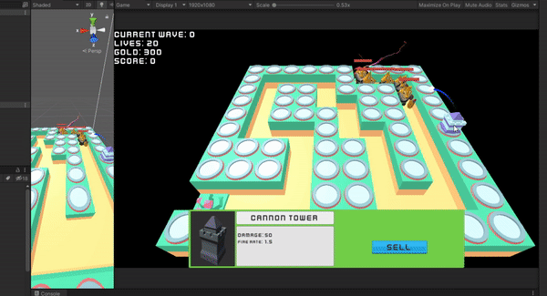

# Tower-Defense
Just testing some features.

Unity 2021.1 URP

- MVC using a generic class. Monobehaviours as views, ScriptableObjects as model
- New input system
- Map editor using custom editor

Assets used:
- https://www.kenney.nl/assets
- https://assetstore.unity.com/packages/3d/characters/animals/dog-knight-pbr-polyart-135227
- https://assetstore.unity.com/packages/3d/characters/creatures/rpg-monster-partners-pbr-polyart-168251
- https://assetstore.unity.com/packages/3d/characters/creatures/party-monster-duo-polyart-pbr-195698
